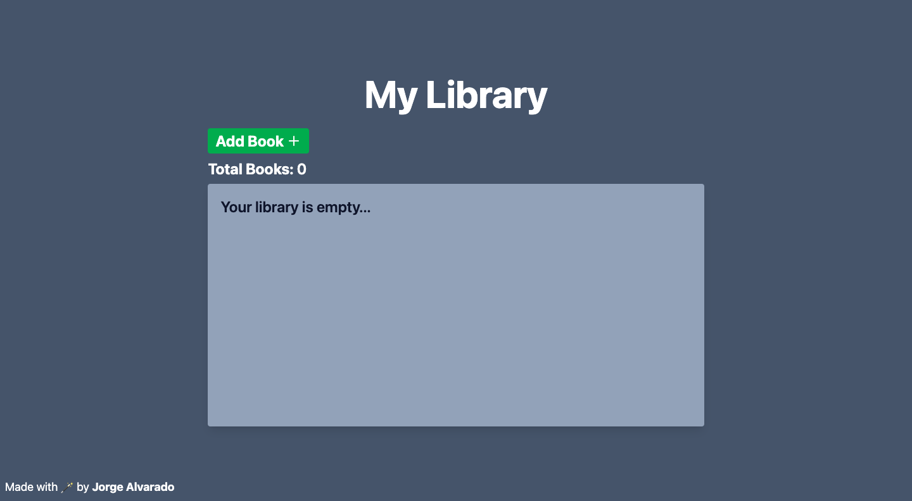

# About The Project

[Demo](https://alvarado08.github.io/library/)

[The Odin Project JavaScript Course Library Project](https://www.theodinproject.com/lessons/foundations-calculator) consisted of making a Library App with the use of objects & a constructor for the creation & storage of books through a simple form.

## The Library can

- Create a new book
- Update reading status
- Delete a book

## Built With

